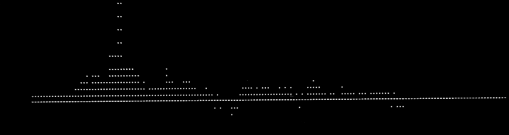
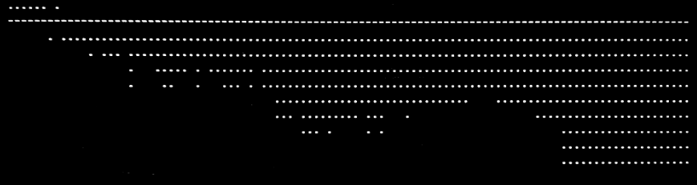

some example graph results from my previous chess games:

example 1:

example 2:
 

there are problem that arises when trying to encode
and it is the ability to edit

if there is a mistake and accidentally done in the process, you have to repeat again
I need to fix this dilemma somehow

I've been thinking of snapshot, then you will have the ability to remove the value in a list

For that I need to make a function somehow because it looks like a spaghetti somehow 

Or maybe I just have to make a tell me where to stop then after that a prompt will show as to whether continue or remove the previous
this will be possible with a while loop

Well, I can make a true edit, where the list are shown and it will find and replace that list

Float checker seem reduntant, I should make a function instead

